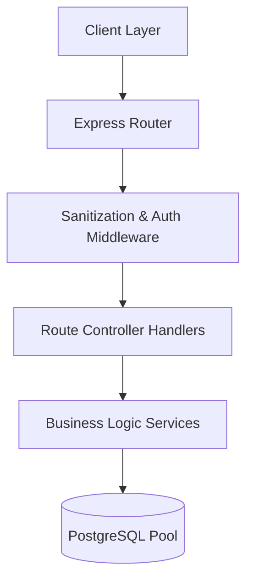

# Architecture Map

```mermaid
graph TD
  Client[Client Layer] --> Router[Express Router]
  Router --> Middleware[Sanitization & Auth Middleware]
  Middleware --> Controllers[Route Controller Handlers]
  Controllers --> Services[Business Logic Services]
  Services --> Database[(PostgreSQL Pool)]
```

The system uses standard model-view-controller (MVC) inspired REST patterns for robust API separation of concerns.